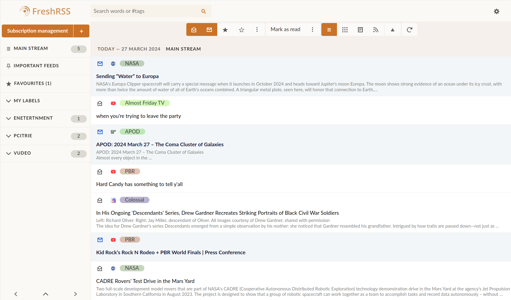

# FreshRSS Better Flux

Modified version of the [ColorfulList](https://github.com/shinemoon/FreshRSS-Dev/tree/master/extensions/xExtension-ColorfulList) extension to only color the name of the feed
+ some tweaks to the flux layout

Works with any configuration of article icons.

## Installation

To use it, simply clone this repo into your ./extensions directory and enable it in the extension panel in FreshRSS
